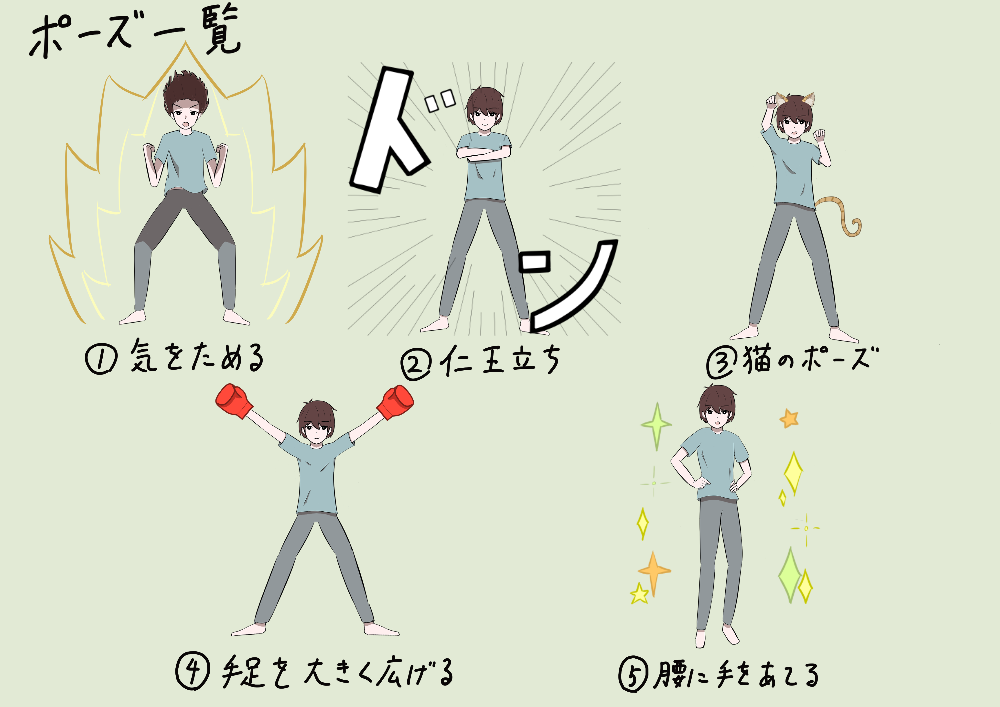

# CVLab_IPDemo
IPカメラデモ

## プログラムの実行について
CVLab_IPDemoの階層にて`python main.py`で起動

## 使用ライブラリ
- python
- opencv
- openpifpaf
- time

## 実行中の操作について
`q`: 座標マーカーを表示

`s`: スクリーンショットカウントダウン開始

`esc`: 終了

## ポーズ一覧

## pifpafで取得した配列格納要素
| 順番 | 要素 |
| --- | --- |
| 0 | 鼻 |
| 1 | 左目 |
| 2 | 右目 |
| 3 | 左耳 |
| 4 | 右耳 |
| 5 | 左肩 |
| 6 | 右肩 |
| 7 | 左ひじ |
| 8 | 右ひじ |
| 9 | 左手首 |
| 10 | 右手首 |
| 11 | 左股関節 |
| 12 | 右股関節 |
| 13 | 左膝 |
| 14 | 右膝 |
| 15 | 左足首 |
| 16 | 右足首 |

## 各疑問連絡先
### 担当箇所
effect.py 29-38: UT-143(上杉)

上記以外: mighty74(堀)
